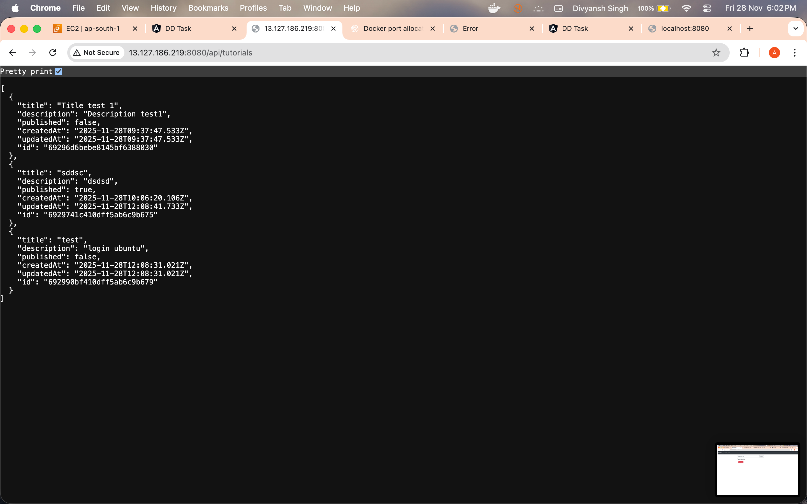
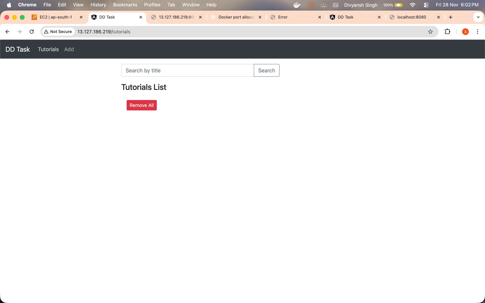

## Overview

This repository implements and deploys a MEAN-stack CRUD application for managing tutorials (title, description, published flag).  
Live environment:

- Frontend (Angular + Nginx reverse proxy): **http://13.127.186.219/**
- Backend API (Express + MongoDB): **http://13.127.186.219:8080/api/tutorials**

The project includes application code, Docker assets, Docker Compose deployment, CI/CD automation, and Nginx reverse-proxy configuration.

## Architecture

- **Frontend**: Angular 15 SPA, served by Nginx. Routes such as `/tutorials` and `/add`. All API calls go through `/api/*`.
- **Backend**: Express/Node REST API with MongoDB (Atlas by default). CRUD endpoints under `/api/tutorials`.
- **Reverse proxy**: Nginx (inside frontend container) proxies `/api/*` to the backend container so the entire stack is reachable via port 80.
- **CI/CD**: GitHub Actions builds/pushes Docker images and redeploys the Ubuntu VM automatically.
- **Deployment target**: Ubuntu VM on AWS (any cloud VM works) running Docker + Compose.

```
Browser -> Nginx (port 80)
          |-- serves Angular dist
          |-- /api -> backend:8080 (Express)
                            |
                            -> MongoDB Atlas (MONGO_URL)
```

## Repository structure

```
backend/                    Express API
frontend/                   Angular SPA + Nginx config
.github/workflows/ci-cd.yml GitHub Actions pipeline
docker-compose.yml          Production stack (frontend + backend)
.gitignore                  Ignores env files and node_modules
```

## Prerequisites

- Node.js ≥ 18 and npm or pnpm (pnpm used for frontend).
- Docker Engine + Docker Compose v2.
- GitHub account with permissions to add repository secrets.
- Docker Hub account for image hosting.
- MongoDB Atlas URI (or local MongoDB installation).

## Local development

### Backend

```bash
cd backend
npm install
MONGO_URL="mongodb://localhost:27017/dd_db" npm start
```

Environment variables:

- `MONGO_URL` – override DB connection string.
- `CORS_ORIGINS` – comma-separated list of allowed origins (defaults include `http://localhost` and `http://13.127.186.219`).

### Frontend

```bash
cd frontend
pnpm install
pnpm ng serve --port 8081
```

The Angular service points to `http://localhost:8080/api/...` while running locally. Visit `http://localhost:8081/`.

## Containerization

### Dockerfiles

- `backend/Dockerfile`: Node 18 Alpine, installs prod deps, runs `node server.js`.
- `frontend/Dockerfile`: multi-stage build (Node 18 + pnpm build → Nginx 1.27 with SPA + reverse proxy).

### Build & push

```bash
# Backend
docker build -t arshthakur/dd-task-backend:latest backend
docker push arshthakur/dd-task-backend:latest

# Frontend
docker build -t arshthakur/dd-task-frontend:latest frontend
docker push arshthakur/dd-task-frontend:latest
```

Make sure to `docker login` first or let GitHub Actions handle the push.

## Deployment on Ubuntu VM (Docker Compose)

1. Provision Ubuntu VM (AWS, Azure, etc.) and install Docker + Compose v2.
2. Copy repo files (or at least `docker-compose.yml`) to the VM.
3. Create `.env` next to `docker-compose.yml`:

```
MONGO_URL=mongodb+srv://<user>:<password>@cluster0.1cmd6cg.mongodb.net/dd_db?retryWrites=true&w=majority&appName=Cluster0
```

4. Start the stack:

```bash
docker compose pull
docker compose up -d
```

Services:

- `dd-task-backend`: Express API, exposed on port 8080 (internally called `backend:8080`).
- `dd-task-frontend`: Nginx/Angular, exposed on port 80, proxies `/api` to `backend`.

To inspect logs: `docker compose logs -f backend` or `frontend`.

### Alternative: manual docker run

```bash
docker network create dd-task || true
docker run -d --name dd-task-backend --net dd-task -p 8080:8080 \
  -e MONGO_URL="..." arshthakur/dd-task-backend:latest
docker run -d --name dd-task-frontend --net dd-task -p 80:80 \
  arshthakur/dd-task-frontend:latest
```

## Database setup options

1. **MongoDB Atlas (preferred)** – supply URI via `MONGO_URL`.
2. **MongoDB on VM** – install MongoDB manually and set `MONGO_URL=mongodb://<vm-ip>:27017/dd_db`.
3. **MongoDB container** – extend `docker-compose.yml` with the official `mongo` image and point `MONGO_URL` to `mongodb://mongo:27017/dd_db`.

## CI/CD pipeline (GitHub Actions)

Workflow file: `.github/workflows/ci-cd.yml`

Stages:

1. `build-and-push`
   - Checks out code.
   - Logs into Docker Hub via `docker/login-action`.
   - Builds & pushes backend and frontend images.
2. `deploy`
   - SSHs into the VM using `appleboy/ssh-action`.
   - Pulls the latest images.
   - Restarts `dd-task-backend` and `dd-task-frontend` containers with the same run commands used in production.

### Required GitHub secrets

| Secret | Description |
| --- | --- |
| `DOCKERHUB_USERNAME` | Docker Hub username (`arshthakur`). |
| `DOCKERHUB_TOKEN` | Docker Hub PAT with **read & write** scopes. |
| `SSH_HOST` | VM public IP/DNS (`13.127.186.219`). |
| `SSH_USER` | SSH username on the VM. |
| `SSH_KEY` | Private key (PEM) for SSH access. |
| `MONGO_URL` | MongoDB connection string passed to backend container. |
| _(optional)_ `CORS_ORIGINS` | Custom CORS origins if deploying under a domain. |

> **Troubleshooting**: If the workflow logs show `access token has insufficient scope`, regenerate the Docker Hub token with push permission and update `DOCKERHUB_TOKEN`.

## Nginx reverse proxy (port 80)

Configured in `frontend/nginx.conf`:

- Serves Angular build from `/usr/share/nginx/html`.
- Proxies `/api/*` to `backend:8080` with proper headers.
- Caches static assets (CSS/JS/images).
- Entire application is reachable at `http://<server-ip>/`, while direct API calls can still be made at `http://<server-ip>/api/...`.

## Verification checklist

- `curl http://13.127.186.219:8080/api/tutorials` returns tutorial JSON.
- Visiting `http://13.127.186.219/` shows the Tutorials UI and CRUD actions work.
- `docker ps` on the VM displays both containers.
- GitHub Actions run log shows successful build/push/deploy after each push to `main`.

## Screenshots & documentation

Below are example screenshots captured from the running AWS deployment:

- **Backend API on AWS (tutorials JSON):**

  

- **Frontend UI on AWS (`/tutorials` page):**

  

You can add more screenshots (CI/CD runs, Docker Hub pushes, Nginx topology, etc.) in a `docs/screenshots/` directory and reference them here in the same way.

## Deliverables recap

- ✅ Repository with full source code (frontend + backend).
- ✅ Dockerfiles and Docker Compose manifest.
- ✅ CI/CD workflow automating build, push, deploy.
- ✅ Ubuntu VM deployment using Docker Compose.
- ✅ MongoDB integration via Atlas (or installable alternative).
- ✅ Nginx reverse proxy serving everything on port 80.
- 🔲 Screenshots (add before final submission).

Need enhancements (HTTPS, autoscaling, monitoring)? Open an issue or reach out.  
Happy building!
